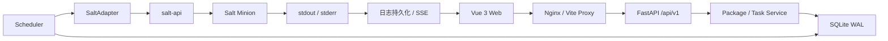

# 云平台自动化维护中心 V1

云平台自动化维护中心（Automation Center）是一个面向小规模云平台节点的单实例维护任务控制面。它通过 Web 页面管理 Salt Minion、校验并保存维护包、按节点排队执行 Shell/Python Step，并集中展示任务状态、实时日志、失败原因和审计记录。

V1 面向不超过 30 台节点、单管理员和固定单批次维护场景。系统不包含 Kubernetes、HA、RBAC、多租户、定时任务、灰度/分批发布、Ansible Executor 或任意命令控制台。

## 核心能力

- Salt Minion Key 接受、拒绝、节点发现和在线状态刷新。
- 根据进程或服务自动识别节点角色，并支持人工修正。
- 流式上传、SHA-256 校验和安全解压维护包。
- 按角色和直接节点选择目标，取并集后按 Node ID 去重。
- 不同节点并发、同一节点 FIFO、单节点内 Step 串行执行。
- Waiting 节点取消、Failed 节点 Retry、历史任务复制。
- Salt 异步 JID 持久化、服务重启恢复和状态丢失保护。
- stdout/stderr 增量采集、普通 offset 查询和 SSE 实时日志。
- 固定共享账号、服务端 Session、CSRF、敏感配置加密和操作审计。
- Dashboard、System Settings、健康检查和 SQLite 自动备份。

## 系统架构



SQLite 是任务状态的事实来源，`TaskNode` 是调度单位。内置 Scheduler 通过数据库唯一节点锁、状态 CAS 和单调队列序号保证同一节点不会并行执行两个任务。Salt 网络调用期间不持有 SQLite 写锁。

生产容器内由 Nginx 终止 TLS，单 Worker Uvicorn 承载 FastAPI 和 Scheduler，Supervisor 负责两个进程的生命周期。Salt Master、salt-api 和 Minion 是外部执行底座，不包含在应用镜像中。

## 技术栈与底层依赖

### 开发和测试环境

| 依赖 | 版本或要求 | 用途 |
|---|---|---|
| Python | 3.12 | FastAPI 后端、Scheduler、开发工具和测试 |
| Node.js | 22 或更高 | Vue 前端、Vite、Vitest 和 Playwright |
| npm | 随 Node.js 提供 | 使用 `package-lock.json` 安装锁定依赖 |
| Chrome | 仅端到端测试需要 | Playwright 配置使用本机 Chrome channel |
| Salt | Fake 模式不需要 | 本地开发默认使用内存 Fake Salt |

后端主要锁定依赖：

| 组件 | 版本 |
|---|---|
| FastAPI | 0.116.1 |
| Uvicorn | 0.35.0 |
| SQLAlchemy | 2.0.43 |
| Alembic | 1.16.5 |
| HTTPX | 0.28.1 |
| PyYAML | 6.0.2 |
| cryptography | 45.0.7 |
| argon2-cffi | 25.1.0 |
| pytest / pytest-cov | 8.4.2 / 6.2.1 |

前端主要锁定依赖：

| 组件 | 版本 |
|---|---|
| Vue | 3.5.18 |
| Vue Router | 4.5.1 |
| Pinia | 3.0.3 |
| Element Plus | 2.11.1 |
| Vite | 7.1.5 |
| TypeScript | 5.9.2 |
| Vitest | 3.2.4 |
| Playwright | 1.55.0 |

完整版本以 [`backend/requirements.lock`](backend/requirements.lock)、[`backend/requirements-test.lock`](backend/requirements-test.lock) 和 [`frontend/package-lock.json`](frontend/package-lock.json) 为准。

### 真实 Salt 执行环境

生产执行需要已部署并互通的 Salt Master、salt-api 和 Salt Minion。仓库不锁定 Salt 软件版本，目标环境必须验证以下能力：

- netapi client：`local`、`local_async`、`runner`、`wheel`。
- Minion function：`test.ping`、`grains.item`、`service.get_all`、`cmd.run`、`cmd.run_all`、`cp.get_file`、`saltutil.kill_job`。
- Job 查询：`jobs.lookup_jid`、`jobs.list_jobs`。
- Key 管理：`key.list_all`、`key.accept`、`key.reject`。
- Salt Fileserver 能读取 `/var/lib/automation-center/packages`。

Minion 还必须提供 `/bin/bash`、`/usr/bin/python3` 和 `tar`，并允许 Salt 执行用户创建和清理 `/var/lib/automation-center/tasks/` 下的任务工作目录。最小权限模板见 [`deploy/salt/master.d/automation-center.conf`](deploy/salt/master.d/automation-center.conf)。

### 生产部署环境

- 目标宿主机：CentOS 9 系列 Linux 环境。
- 容器运行时：Docker Engine 和 Docker Compose 插件。
- 外部服务：宿主机 Salt Master、salt-api 和已接入的 Minion。
- TLS：服务器证书 `certs/tls.crt` 和私钥 `certs/tls.key`。
- 持久化目录：宿主机 `/var/lib/automation-center/`。
- 镜像内组件：Python 3.12、Node 22 构建阶段、Nginx、Supervisor、单 Worker Uvicorn。

Nginx 和 Supervisor 由容器基础镜像的软件源安装，仓库没有单独锁定它们的系统包版本。

## 端口与网络

| 端口 | 场景 | 说明 |
|---|---|---|
| 5173 | 本地开发 | Vite 开发服务器，将 `/api` 代理到后端 8080 |
| 8080 | 本地开发 | Uvicorn HTTP 监听端口 |
| 8080 | 生产容器 | Nginx HTTP 入口，仅重定向到 HTTPS 8443 |
| 8443 | 生产容器 | Nginx HTTPS、静态页面和 `/api` 入口 |
| 8001 | 生产容器内部 | 单 Worker Uvicorn，仅监听回环地址 |
| 8000 | 宿主机 | salt-api 默认回环监听端口 |

Compose 使用 `network_mode: host`，使容器内应用可以访问宿主机 `127.0.0.1:8000`，同时无需把 salt-api 放宽到外部网络。

## 仓库结构

| 路径 | 职责 |
|---|---|
| `backend/src/automation_center/` | FastAPI、认证、Service、Scheduler、Salt Adapter 和数据模型 |
| `backend/alembic/` | SQLite Schema 迁移 |
| `backend/tests/` | 后端单元、集成、安全、并发和恢复测试 |
| `frontend/src/` | Vue 页面、路由和 API 客户端 |
| `frontend/tests/` | Vitest 和 Playwright 测试 |
| `deploy/` | Nginx、Supervisor、容器入口和 Salt 最小权限模板 |
| `scripts/` | 开发辅助工具，不属于生产 API |
| `docs/` | 新人指南、测试用例和需求追踪矩阵 |
| `certs/` | TLS 文件放置说明；私钥不会提交到仓库 |

## 使用 Fake Salt 快速启动

Fake Salt 用于本地开发和自动化测试，不需要安装 Salt，也不会在本机真正执行维护脚本。详细的 30 分钟上手流程见 [`docs/developer-onboarding.md`](docs/developer-onboarding.md)。

以下命令适用于仓库根目录下的 PowerShell。

### 1. 安装后端依赖

```powershell
python -m venv .venv
.\.venv\Scripts\python.exe -m pip install -r .\backend\requirements-test.lock
```

### 2. 启动后端和 Scheduler

```powershell
$env:AUTOMATION_CENTER_DATA_DIR="$PWD\data"
$env:AUTOMATION_CENTER_COOKIE_SECURE="false"
$env:AUTOMATION_CENTER_SALT_MODE="fake"
$env:AUTOMATION_CENTER_ENABLE_SCHEDULER="true"
$env:AUTOMATION_CENTER_INITIAL_USERNAME="admin"
$env:AUTOMATION_CENTER_INITIAL_PASSWORD="local-demo-password"
$env:AUTOMATION_CENTER_APP_SECRET="local-development-secret-change-in-production"
.\.venv\Scripts\python.exe -m uvicorn automation_center.main:create_app --factory --app-dir backend/src --host 127.0.0.1 --port 8080
```

### 3. 启动前端

在另一个 PowerShell 中执行：

```powershell
Set-Location frontend
npm ci
npm run dev
```

访问 `http://127.0.0.1:5173`，使用本地示例账号 `admin / local-demo-password` 登录。

### 4. 生成演示维护包

```powershell
.\.venv\Scripts\python.exe .\scripts\build_demo_package.py
```

默认输出为 `data/onboarding-demo.bundle.tar.gz`。随后在页面中刷新 Fake 节点、上传维护包、选择 `demo-node` 创建任务，并在任务详情查看两个 Step 的状态和日志。

初始账号环境变量只在数据库第一次创建时生效。已有开发数据库需要使用 CLI 重置账号，或在确认无需保留数据后重新初始化本地 `data/`。

## 维护包协议

当前实现要求外层归档严格包含：

```text
inner-package.tar.gz
inner-package.sha256
```

SHA 文件必须使用标准格式：64 位 SHA-256、两个空格、固定文件名 `inner-package.tar.gz`。内层包包含 `manifest.yaml`、Shell/Python 脚本和脚本需要的资源文件；`manifest_version` 必须为 `1`。

上传校验会拒绝绝对路径、`..`、目录逃逸、重复路径、符号链接、硬链接、设备文件、超限文件数和解压炸弹。开发者可以使用 [`scripts/build_demo_package.py`](scripts/build_demo_package.py) 查看最小合法包结构。

部分早期设计文档仍保留 `payload.tar.gz`/`payload.sha256` 示例；当前代码、`需求文档.md` 和本 README 中的 `inner-package.*` 协议优先。

## 生产部署

### 1. 配置 Salt

将 [`deploy/salt/master.d/automation-center.conf`](deploy/salt/master.d/automation-center.conf) 合并到 Salt Master 配置，创建对应的 `file` eAuth 用户，并重启 `salt-master`、`salt-api`。随后执行 [`deploy/salt/verify-salt-api.sh`](deploy/salt/verify-salt-api.sh) 验证最小能力。

### 2. 准备应用配置

```bash
cp .env.example .env
```

必须替换 `.env` 中的密码、应用密钥和 Salt credential。`.env` 已被 Git 忽略，不得提交。

### 3. 准备 TLS

按照 [`certs/README.md`](certs/README.md) 放置：

```text
certs/tls.crt
certs/tls.key
```

私钥必须只读挂载并限制文件权限，仓库已忽略 `certs/*.key`。

### 4. 构建并启动

```bash
docker compose build
docker compose up -d
```

启动后访问 `https://<management-ip>:8443`，并检查：

```text
GET /api/v1/health/live
GET /api/v1/health/ready
```

容器启动顺序为 SQLite Backup API 备份、Alembic 迁移、默认配置初始化、持久化配置加载和 Scheduler 启动。迁移失败时应用拒绝进入可服务状态。

## 配置项

| 环境变量 | 默认值 | 说明 |
|---|---|---|
| `AUTOMATION_CENTER_INITIAL_USERNAME` | `admin` | 首次初始化的固定账号 |
| `AUTOMATION_CENTER_INITIAL_PASSWORD` | 开发默认值 | 首次初始化密码；生产必须显式设置 |
| `AUTOMATION_CENTER_APP_SECRET` | 开发默认值 | 敏感配置加密密钥；生产入口拒绝默认值 |
| `AUTOMATION_CENTER_DATA_DIR` | `/var/lib/automation-center` | 数据根目录 |
| `AUTOMATION_CENTER_DATABASE_URL` | 数据目录下的 SQLite | SQLAlchemy 数据库 URL |
| `AUTOMATION_CENTER_PACKAGE_DIR` | `<data>/packages` | 已校验维护包目录 |
| `AUTOMATION_CENTER_TEMP_DIR` | `<data>/temp` | 上传和校验临时目录 |
| `AUTOMATION_CENTER_LOG_DIR` | `<data>/logs` | 中央执行日志目录 |
| `AUTOMATION_CENTER_WORK_DIR` | `<data>/work` | 本地工作目录 |
| `AUTOMATION_CENTER_BACKUP_DIR` | `<data>/backups` | SQLite 备份目录 |
| `AUTOMATION_CENTER_COOKIE_SECURE` | `true` | 本地 HTTP 开发必须设为 `false` |
| `AUTOMATION_CENTER_SALT_MODE` | `fake` | `fake` 或 `http` |
| `AUTOMATION_CENTER_SALT_API_URL` | `http://127.0.0.1:8000` | salt-api 地址 |
| `AUTOMATION_CENTER_SALT_API_USERNAME` | `automation` | salt-api eAuth 用户 |
| `AUTOMATION_CENTER_SALT_API_CREDENTIAL` | 空 | salt-api credential；数据库中加密保存 |
| `AUTOMATION_CENTER_SALT_EAUTH` | `file` | salt-api 外部认证类型 |
| `AUTOMATION_CENTER_STARTUP_MIGRATE` | `true` | 启动时执行备份和 Alembic 迁移 |
| `AUTOMATION_CENTER_ENABLE_SCHEDULER` | `true` | 是否随应用启动 Scheduler |

首次启动后，部分运行参数会由 SQLite 中的 `SystemSetting` 覆盖环境变量。Salt credential 在 API 中永不明文回显。

## 持久化数据

生产数据统一保存在 `/var/lib/automation-center/`：

```text
db/         SQLite 数据库
packages/   当前 Package Revision 文件
logs/       Attempt / Step stdout 和 stderr
work/       应用工作目录
temp/       流式上传和 Nginx 临时文件
backups/    迁移前 SQLite 备份
```

成功的远端工作目录会立即清理；失败工作目录默认保留 7 天。执行日志默认保留 7 天，Task、Attempt 和 StepResult 等结构化历史长期保留。

## 安全设计

- 密码使用 Argon2id Hash，Session Token 和 CSRF Token 在数据库中只保存 SHA-256 Hash。
- Session 空闲 8 小时过期，绝对有效期 24 小时；写接口必须同时通过 Session 和 CSRF。
- Salt credential 使用应用密钥派生的 Fernet Key 加密，页面和 API 只返回掩码。
- Nginx 终止 TLS，Cookie 使用 HttpOnly、Secure、SameSite=Strict。
- Package 上传使用流式写盘和归档成员白名单，默认上限 10 GiB。
- 节点执行依赖数据库唯一锁和 CAS，未知 JID 标记为 `EXECUTION_STATE_LOST`，不会自动重复下发。

## 测试

### 后端

```powershell
Set-Location backend
..\.venv\Scripts\python.exe -m pytest
```

pytest 全局配置要求行覆盖率不低于 85%。单文件调试时使用 `--no-cov`，避免被全项目覆盖率门槛误判。

### 前端

```powershell
Set-Location frontend
npm run test
npm run build
$env:CI="1"
npm run test:e2e
```

自动化测试覆盖 Fake Salt 成功、失败、超时、JID 丢失、并发 Claim、Cancel/Claim 竞争、恶意 Tar、Session/CSRF 和核心页面流程。

真实 Salt、目标 CentOS 9 容器、30 节点并发和 10 GiB 上传容量必须在对应环境中验收，不能由 Fake Salt 或本地单机结果替代。

## 文档

- [后端开发者快速上手](docs/developer-onboarding.md)
- [测试用例](docs/test-cases.md)
- [需求—接口—测试追踪矩阵](docs/requirements-traceability.md)
- [需求规格说明书](需求文档.md)
- [系统详细架构设计](云平台自动化维护中心%20V1——系统详细架构设计.md)
- [Task / Node / Step 状态机与调度器设计](云平台自动化维护中心%20V1——Task%20%20Node%20%20Step%20状态机与调度器详细设计.md)
- [维护包 Manifest 与出包规范](维护包%20manifest.yaml%20与出包规范.md)

文档发生冲突时，优先级为：当前明确决策、`需求文档.md`、状态机/出包规范/架构设计。代码行为和自动化测试用于确认当前实现事实。

## 当前边界

- 单实例、单 Uvicorn Worker；不支持 HA 或多副本 Scheduler。
- SQLite WAL 是唯一数据库实现，不支持 PostgreSQL。
- Executor 仅支持 Shell 和 Python。
- 不支持 RBAC、多租户、定时任务、灰度/分批或运行时业务参数。
- 服务端 SSE 支持 `Last-Event-ID` 按 offset 续传；当前前端在 EventSource 出错时主动关闭连接，尚未实现自动重连。
- Package SHA-256 只用于完整性校验，不表示发布者身份认证。

## 运维命令

重置固定共享账号会同时清理现有 Session：

```bash
docker exec automation-center automation-center reset-password --username admin --password '<new-strong-password>'
```

手工创建 SQLite 备份：

```bash
docker exec automation-center automation-center backup
```
