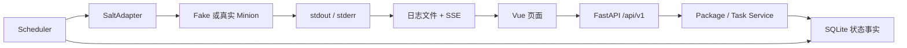
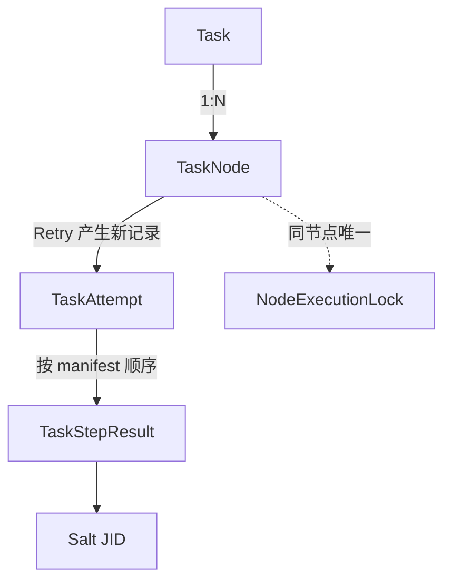

# 云平台自动化维护中心 V1：后端开发者快速上手

## 1. 这份指南解决什么问题

这份文档面向第一次接触本仓库的后端开发者。目标不是替代需求和架构文档，而是帮助你在约 30 分钟内完成四件事：启动本地 Fake Salt 环境、跑通一次维护任务、建立核心代码调用链、知道修改代码后应执行哪些测试。

当前实现的技术边界是 FastAPI、SQLAlchemy 2、Alembic、SQLite WAL、Vue 3 和 Salt。V1 是单实例、单 Uvicorn Worker，没有 PostgreSQL、AWX、独立 Agent、Kubernetes、RBAC、多租户或定时任务。

## 2. 先建立最小心智模型

一次维护任务的主链路如下：



- API 负责认证、校验、序列化和审计，不直接执行维护脚本。
- Package Service 负责把不可信上传包校验成可执行的 Package Revision。
- Task Service 负责目标选择、风险确认、永久幂等、快照和排队。
- Scheduler 以 TaskNode 为调度单位；不同节点可并发，同一节点严格串行。
- SaltAdapter 隔离 Fake Salt 与真实 salt-api。SQLite 是任务状态的唯一事实来源。

任务数据关系如下：



Task 只是聚合状态；真正排队和执行的是 TaskNode。Attempt 只在 Scheduler 获得节点锁、准备真实执行时创建，因此取消 Waiting 节点不会产生空 Attempt。Retry 复用 TaskNode，但创建新的 Attempt，并从 Step1 开始。

## 3. 30 分钟跑通本地闭环

### 3.1 前置条件

- Python 3.12
- Node.js 22 或更高版本
- PowerShell
- Chrome（仅运行 Playwright 时需要）

本地闭环使用 Fake Salt，不需要安装 Salt、Nginx 或 Docker。

### 3.2 安装后端依赖

在仓库根目录执行：

```powershell
python -m venv .venv
.\.venv\Scripts\python.exe -m pip install -r .\backend\requirements-test.lock
```

### 3.3 启动后端和 Scheduler

打开第一个 PowerShell：

```powershell
$env:AUTOMATION_CENTER_DATA_DIR="$PWD\data"
$env:AUTOMATION_CENTER_COOKIE_SECURE="false"
$env:AUTOMATION_CENTER_SALT_MODE="fake"
$env:AUTOMATION_CENTER_ENABLE_SCHEDULER="true"
$env:AUTOMATION_CENTER_INITIAL_USERNAME="admin"
$env:AUTOMATION_CENTER_INITIAL_PASSWORD="correct-password"
$env:AUTOMATION_CENTER_APP_SECRET="local-development-secret-change-before-production"
.\.venv\Scripts\python.exe -m uvicorn automation_center.main:create_app --factory --app-dir backend/src --host 127.0.0.1 --port 8080
```

启动时会创建 `data/db/automation-center.db`，执行 Alembic，并把默认账号和系统设置写入数据库。初始账号只在数据库第一次创建时生效；之后修改环境变量不会覆盖已有密码。

### 3.4 启动前端

打开第二个 PowerShell：

```powershell
Set-Location frontend
npm ci
npm run dev
```

访问 `http://127.0.0.1:5173`，使用 `admin / correct-password` 登录。Vite 把 `/api` 代理到 `http://127.0.0.1:8080`。

### 3.5 生成演示维护包

回到仓库根目录：

```powershell
.\.venv\Scripts\python.exe .\scripts\build_demo_package.py
```

默认生成 `data/onboarding-demo.bundle.tar.gz`。需要自定义时使用：

```powershell
.\.venv\Scripts\python.exe .\scripts\build_demo_package.py --name my-demo --output .\data\my-demo.bundle.tar.gz
```

演示包包含一个 Shell Step 和一个 Python Step，目标角色为 `compute`。它只输出安全的演示文本，不修改系统配置。

### 3.6 从页面完成任务

1. 进入“节点中心”，点击“立即探测”。Fake Salt 内置的 `demo-node` 会以 Online 节点出现；点击“角色”并人工设置为 `compute`。
2. 进入“维护包中心”，上传刚生成的外层包。
3. 进入“创建维护任务”，选择演示包和 `demo-node`，生成确认快照并创建任务。
4. 进入任务详情，观察 Task、TaskNode、Attempt 和两个 Step 的结果与日志。

Fake Salt 不会在本机真正执行包内脚本；它按确定性契约模拟 JID、状态和日志。真实脚本只在接入 salt-api/minion 后执行。

## 4. 仓库目录和推荐阅读顺序

| 位置 | 职责 | 建议关注点 |
|---|---|---|
| `backend/src/automation_center/` | 后端业务代码 | 启动、API、服务、调度、Salt、模型 |
| `backend/alembic/` | 数据库迁移 | 生产启动只信任 Alembic Schema |
| `backend/tests/` | 单元和集成测试 | Fake Salt 闭环、并发、安全和恢复 |
| `frontend/src/` | Vue 管理页面 | API 契约、CSRF、Task/SSE 页面入口 |
| `deploy/` | Nginx、Supervisor、Salt 模板 | 单容器、TLS、SSE、最小权限 |
| `docs/` | 测试、追踪和本指南 | 当前实现的验收边界 |

建议按以下顺序读代码：

1. `main.py`、`config.py`、`database.py`：应用如何启动、迁移、加载设置并启动 Scheduler。
2. `api.py`、`security.py`：请求如何经过 Session、CSRF、业务处理和审计。
3. `package_service.py`、`task_service.py`：上传包如何变成 Revision，Task 如何快照和排队。
4. `scheduler.py`、`salt.py`：TaskNode 如何 Claim、执行、采集日志、超时和恢复。
5. `models.py` 和 Alembic：持久化对象和删除/快照语义。
6. `backend/tests/`：用可执行测试确认你对状态机的理解。

## 5. 五个必须理解的实现原则

### 5.1 Session、CSRF 和敏感信息

浏览器只保存随机 Session Cookie；数据库只保存 Token Hash。写接口依赖 Session 和 `X-CSRF-Token`。Session 空闲 8 小时、绝对 24 小时过期。Salt credential 使用应用密钥派生的 Fernet Key 加密，API 永远只返回掩码。

本地 HTTP 必须设置 `AUTOMATION_CENTER_COOKIE_SECURE=false`；生产由 Nginx 终止 HTTPS，必须保持 Secure Cookie。

### 5.2 SQLite 是状态事实来源

连接建立时启用 WAL、foreign key 和 busy timeout。调度器把持久化更新拆成短写事务；执行主路径会在包传输前提交事务，Salt 网络等待期间不持有 SQLite 写锁。并发写入依靠唯一约束、CAS 和 `BEGIN IMMEDIATE` 收敛。

### 5.3 FIFO 与 Node Lock

`queue_seq` 是全局单调序号。Claim 前会检查同节点是否存在更早的 Waiting 项，避免越序。`node_execution_locks.node_id` 是主键，保证同一节点最多一个 Running TaskNode。内存中的 `_running` 只用于避免本进程重复提交，不是最终一致性来源。

### 5.4 JID 和重启恢复

每个 Step 使用 `local_async` 下发，并尽早持久化 JID。服务重启后只查询已有 JID，不自动重复下发。无法确认的 JID 收敛为 `EXECUTION_STATE_LOST`。这条规则优先于“自动重试”，因为重复执行维护脚本风险更高。

### 5.5 Package 是不可信输入

上传始终流式写盘。外层包必须包含 `inner-package.tar.gz` 和 `inner-package.sha256`；SHA 文件格式为 64 位摘要、两个空格、固定文件名。校验会拒绝路径穿越、绝对路径、重复路径、链接、设备文件、过大 Manifest、过多文件和解压后超限。

Update 先在临时目录完成校验，再切换到新 Revision；Waiting/Running 引用存在时返回 409。历史 Task 依赖快照，不依赖当前 Package 文件。

## 6. 常见调用链

### 创建任务

```text
POST /api/v1/tasks/preview
  → task_preview
  → resolve_nodes
  → 返回实际节点和 OFFLINE / ROLE_MISMATCH 警告

POST /api/v1/tasks
  → Session + CSRF + Idempotency-Key
  → create_task 再次 Preview
  → BEGIN IMMEDIATE 分配 queue_seq
  → 写入 Task 和 TaskNode 快照
```

### 执行任务

```text
Scheduler.run
  → tick
  → _claim：FIFO、Online、Revision、Node Lock、CAS
  → 创建 Attempt 和 StepResult
  → _execute：下发包、准备工作目录
  → _execute_step：local_async、持久化 JID、采集日志、等待结果
  → _finish_node
  → aggregate_task
```

### 日志

后端把每个 Attempt/Step 的 stdout 和 stderr 保存到独立文件。普通日志接口按 offset 读取；SSE 接口接受 `Last-Event-ID` 并从对应 offset 继续。当前前端在 EventSource `error` 时会主动关闭连接，因此“前端自动断线续传”仍是待完善项，不能当成已实现能力。

## 7. 调试入口与常见问题

- 健康检查：`GET http://127.0.0.1:8080/api/v1/health/live` 和 `/health/ready`。
- OpenAPI：`http://127.0.0.1:8080/docs`。
- SQLite：`data/db/automation-center.db`。
- Package：`data/packages/<package-id>/v<revision>/inner-package.tar.gz`。
- 日志：`data/logs/<task-id>/<task-node-id>/attempt-<n>/`。
- 备份：`data/backups/`。

常见问题：

- 登录成功后仍返回 401：检查本地是否忘记把 Secure Cookie 关闭。
- 前端请求打到错误端口：确认后端使用 8080，Vite 使用 5173。
- 修改初始密码环境变量没有效果：数据库已经初始化，使用容器 CLI 或删除仅供本地开发的 `data/` 后重新初始化。
- 单文件 pytest 全部通过但命令仍失败：全局配置要求全项目覆盖率 85%，局部调试应加 `--no-cov`。
- Package 上传 422：优先检查外层固定文件名、SHA 两个空格、`manifest_version: 1` 和脚本相对路径。

## 8. 第一次修改代码的建议流程

1. 从 `docs/requirements-traceability.md` 找到需求域和现有测试。
2. 先写或修改对应测试，再调整 Service/Scheduler/API。
3. 局部调试，例如：

```powershell
Set-Location backend
..\.venv\Scripts\python.exe -m pytest --no-cov tests\test_scheduler.py -q
```

4. 提交前运行完整回归：

```powershell
Set-Location backend
..\.venv\Scripts\python.exe -m pytest

Set-Location ..\frontend
npm run test
npm run build
$env:CI="1"
npm run test:e2e
```

新增注释时解释“为什么”和“不变量”，不要逐行翻译语法。涉及并发、事务、安全、恢复和外部系统时，注释必须与测试或代码事实一致。

## 9. 文档优先级与事实边界

出现冲突时按以下顺序判断：

1. 用户当前明确确认的决策。
2. `需求文档.md`。
3. 状态机、出包规范和架构设计文档。
4. `1 自动化中心.md` 只作为已验证 Salt 环境参考。

当前代码和本指南使用 `inner-package.tar.gz` 与 `inner-package.sha256`。旧文档中出现的其他外层文件名不能覆盖当前已确认实现。自动化测试边界见 `docs/test-cases.md`；其中真实 Salt、CentOS 容器、30 节点和 10 GiB 容量项仍需目标环境验收。
